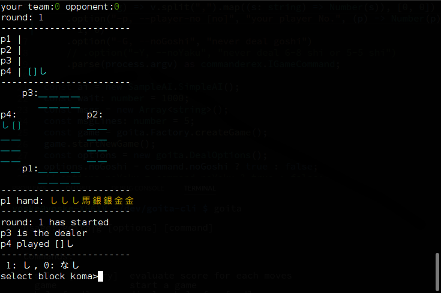
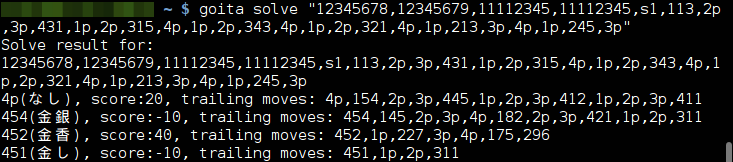

[](https://travis-ci.org/Goita/goita-cli)

# goita-cli
Goita Command Line Interface (Node.js)

# Install

```
npm install -g goita-cli
```

# Start Goita game
Start a goita game with computer players.

```
goita game
```


MEMO: never deal goshi or Yaku(6-8 shi, 5-5 shi) by default

param(short) | param(long) | value | example
---------|----------|---------|-----------
 -i | --initial-state | history`[string]`| `"12345678,12345679,11112345,11112345,s1"`
 -s | --initial-score | scores `[(1&3_score),(2&4_score)]`| `140,0`
 -p | --player-no | No. `[1-4 number]` | `1`
-G | --noGoshi | `[switch option]` | 
-Y | --noYaku | `[switch option]` | 

# Game rules
Rules ([日本語](http://goita.jp/rule/)) | ([English](https://www.pagat.com/climbing/goita.html))

# Evaluate moves

```
goita solve [history]
```


# Specifications of history string

Take a look at [goita-core README @HistoryString](https://github.com/Goita/goita-core-js#historystring)
